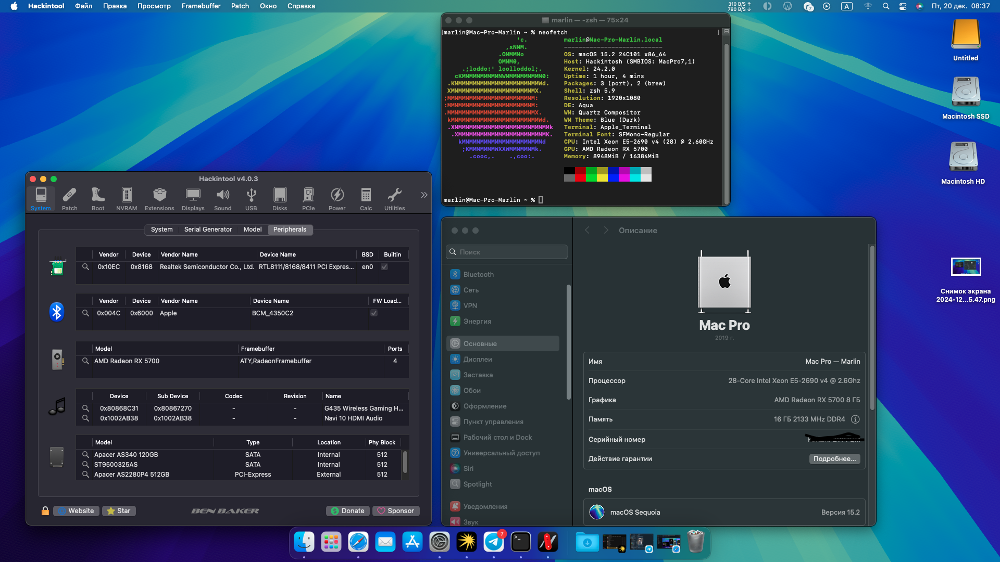

# HUANANZHI X99 QD4 + Intel® Xeon® E5-2690 v4 + AMD Radeon™ RX 5700

**Latest working macOS**: 15.2
 
**Current OpenCore**: 1.0.3

---

## Complete hardware specs

- Motherboard Name:	Huananzhi X99-QD4 | Motherboard Chipset:	Intel Lynx Point - B85, Intel Brosdwell-EP
- CPU Type: 14-Core Intel® Xeon® E5-2690 v4, 2600-3200 MHz
- Memory: 2 X 16 GB DDR4-2400 Reg. ECC DDR4 SDRAM
- Video Adapter: AMD Radeon™ RX 5700  (8176 MB)
- Audio Adapter: Realtek ALC887 @ Intel Lynx Point PCH - High Definition Audio Controller
- Ethernet Adapter: Realtek PCIe GbE Family Controller
- Network Adapter: Broadcom 802.11ac Network Adapter
- Disk Drive: NVME Apacer 512 GB

## What works

- macOS Sequoia, Sonoma, Ventura, Big Sur, Catalina and macOS Monterey
- Audio
- HDMI/DP (in dGPU - Works OOB)
- All USB ports
- Everything iCloud related (Drive, iMessage, Facetime, unlock with Apple Watch, etc)
- Temperature monitoring for everything
- DRM content (Netflix, ATV+, Airplay 2 mirroring etc)
- Shutdown/Reboot/Update to newer macOS builds over time
- Resizable Bar ON (ResizeUsePciRbIo = true)
- Wi-fi/Bluetooth/AirDrop - OpenCore Legacy Patcher

## Kexts used:

- [x] AppleALCU.kext
- [x] CpuTscSync.kext
- [x] Lilu.kext
- [x] RealtekRTL8111.kext
- [x] RestrictEvents.kext
- [x] SMCSuperIO.kext
- [x] SMCProcessor.kext
- [x] USBInjectAll.kext
- [x] VirtualSMC.kext
- [x] WhateverGreen.kext

## How does it works (if you have the same hardware):
  0. Config the BIOS, expecs bellow
  1. Get the EFI
  2. Config the SMBIOS, generating one with genSMBIOS, then edit it using properTree: ROM, SystemUUID, MLB, system serial number
  3. Download **macOs Catalina** from macrecovery
  4. Create the bootable pen drive, install Catalina from Open Core
  5. Update from oficial Apple

## BIOS Settings:
Access the bios, using DEL key during start
## Disable
  1. Go to advanded -> ACPI settings -> ACPI sleep state -> disable
  2. Go to advanded -> NCT55320 Super IO configuration -> Serial Port 1 -> serial port -> disable
  3. Go to advanded -> CSM Configuration -> video -> change to UEFI -> disable
  4. Reboot the machine
  5. Go to advanded -> CSM Configuration -> CSM Support -> disable
  6. IntelRCSetup -> Processor Configuration -> MSR Lock Control -> disable
  7. IntelRCSetup -> Processor Configuration -> Execute Disable Bit -> disable

 ## Enable
 1. Go to advanded -> USB Configuration -> XHCI Hand-off -> enable
 2. Go to advanded -> USB Configuration -> EHCI Hand-off -> enable
 3. InterRCSetup -> Processor Configuration -> Hyper Threading -> enable

